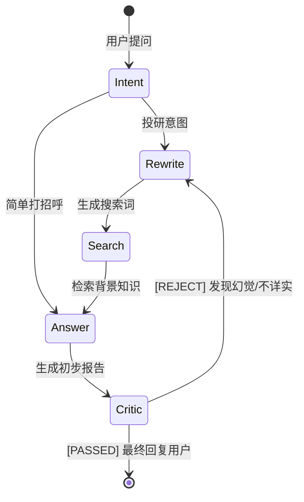

# Agent 智能体逻辑与状态机（Agent Handbook）

本项目不仅是一个 RAG 程序，更是一个能够**自我思考、自我评审、自动重试**的 Agent 决策系统。

## 1. 核心状态机 (LangGraph Topology)

## 2. 状态定义 (`AgentState`)

我们通过 `TypedDict` 定义了全局状态，这些状态在整个图中透明流转：
- `messages`: 包含用户和 AI 的对话历史。
- `knowledge`: 检索到的上下文信息（不入消息历史，保持 Prompt 干净）。
- `retry_count`: 记录被 `Critic` 打回的次数，防止死循环。
- `review_notes`: `Critic` 节点给出的修改建议。

## 3. 为什么是 Agent 而不是 Chain？

**面试话术总结：**
- **Chain (链)**：是线性的，A -> B -> C。如果 B 环节搜到的资料是垃圾，C 环节只能对着垃圾生成。
- **Agent (智能体)**：是环形的。我们的系统在 `Critic` 环节如果发现质量不行，会**强制回退（Backtracking）**。
- **自反思 (Self-Reflection)**：这展示了对大模型局限性的深刻认识——我不相信 LLM 第一次就能答对，我通过外部工程链路（Graph）建立了闭环校验。

## 4. 持久化与断点续执行

基于 **Postgres Checkpointer** 的特性：
1. **多轮对话**：用户的问题会根据 `thread_id` 自动关联到上一次的消息列表。
2. **容错重试**：如果 AI 思考到一半网络断了，用户刷新后，Checkpointer 能让 Agent 从报错的那个节点继续运行，而不是重新开始。
