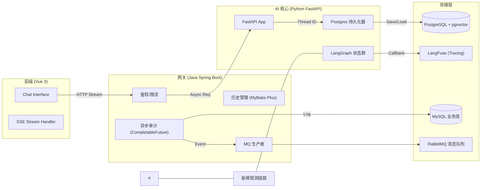

# 系统架构深度解析（Architecture Deep Dive）

本项目采用了典型的 **异构分布式 AI 架构**，旨在解决大模型应用中的响应延迟、状态持久化与高并发审计问题。

## 1. 全链路流程图 (Full-Stack Flow)

## 2. 核心设计决策 (Design Decisions)

### 2.1 为什么采用 Java + Python 双后端？
- **Java (Gateway)**：处理高并发 IO、数据库审计、消息队列非常成熟。在校招面试中，这展示了你对**企业级解耦**的理解。
- **Python (AI Core)**：AI 生态（LangChain/LangGraph/PyTorch）无出其右。
- **价值**：避免了 Python 在处理重业务逻辑时的性能瓶颈，也避免了 Java 处理大模型编排时的繁琐。

### 2.2 SSE（Server-Sent Events） vs WebSocket
- **选择理由**：SSE 是单向流（Server 到 Client），对于 LLM 问答这种“一问一答，持续输出”的场景最轻量、最稳定。
- **面试点**：对比 Websocket 的双向握手开销，SSE 更符合 RESTful 风格，且内置了掉线自动重连机制。

## 3. 关键交互时序

1. **用户提问**：Vue 建立 EventSource 连接。
2. **网关拦截**：Java 鉴权通过，向 Python 转发并透传 `TraceId`。
3. **AI 思考**：LangGraph 运行，期间不断推送 `stage` 事件（rewrite/search/reasoning）。
4. **异步审计**：Java 收到完整回复后，立即通过 CompletableFuture 启动后台任务，录入 MySQL 并下发 MQ。
5. **UI 更新**：前端解析 Markdown 流并展示。

## 4. 可观测性设计 (Observability)

- **LangFuse 深度追踪**：通过私有化部署 LangFuse，实现了对 Agent 内部每一个 Node（从 rewrite 到 critic）的秒级监控。包括：
    - **Token 使用量分析**：精确计算每一轮对话的成本。
    - **Prompt 迭代历史**：记录不同版本 Prompt 的效果。
    - **耗时瀑布图**：一目了然定位检索或推理的瓶颈。
- **关联一致性**：将业务层的 `TraceId` 与 AI 层的 `SessionId` 强绑定。面试时可以演示如何根据一个订单号，倒查出 AI 当时的整个思维过程。
