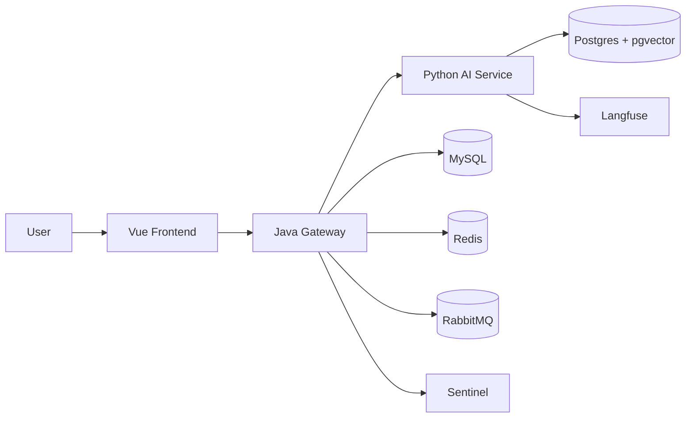

# Architecture

## 1. 分层原则

这个项目刻意拆成 `Java 业务层 + Python AI 层`。

- `Java Gateway` 负责稳定业务能力：鉴权、会员、配额、行情、交易、会话历史、人工工单、审计。
- `Python AI Service` 负责不稳定且迭代快的 AI 能力：模型调用、LangGraph 编排、RAG、流式输出、质量评审。
- `Frontend` 只面向统一网关，不直接访问 AI 服务。

这样拆分的价值是：业务边界清晰、技术栈各司其职，面试时也更容易说明为什么不是“全部堆在一个服务里”。

## 2. 系统拓扑

## 3. 各层职责

### Frontend

- 页面工作台、登录态管理、业务模块切换。
- AI 会话通过 `fetch + ReadableStream` 处理 `SSE`，避免 `EventSource` 不能带自定义 Header 的限制。
- 对用户只暴露一个统一入口，降低前端和后端耦合。

### Java Gateway

- 统一鉴权与用户上下文，采用 `Spring Security + Bearer Token + Redis` 维护登录态。
- 处理会员、行情、自选股、模拟交易、聊天历史、人工工单。
- 将 AI 请求透传到 Python 服务，并补充 `userId / role / traceId / sessionId` 等业务上下文。
- 持久化聊天记录与审计数据，必要时异步投递消息。

### Python AI Service

- 接收网关转发的 AI 请求。
- 使用 LangGraph 组织 `rewrite -> search/fetch -> answer -> critic` 工作流。
- 根据用户角色决定走精简流还是完整流。
- 将会话状态和检索数据持久化到 Postgres / pgvector。

## 4. 核心请求链路

### AI 流式问答链路

1. 前端发起 AI 问答请求。
2. Java 网关完成鉴权、生成 `traceId`、记录会话上下文。
3. Java 调用 Python AI 服务的流式接口。
4. Python LangGraph 按阶段执行重写、检索、生成、评审。
5. Python 以 SSE 持续返回阶段事件和正文增量。
6. Java 透传 SSE 给前端，并在结束后更新聊天记录、触发审计或工单逻辑。

### 人工兜底链路

1. AI 不确定，或者用户主动要求转人工。
2. Java 侧创建工单并保存 `traceId`、会话上下文和问题内容。
3. 管理端处理工单。
4. 处理结果回流到原会话，形成闭环。

## 5. 中间件为什么存在

- `MySQL`：业务主数据，适合账号、会员、交易、工单、历史记录。
- `Redis`：热点缓存、验证码、冷却时间、下单锁。
- `RabbitMQ`：解耦审计和后续异步消费，避免主链路阻塞。
- `Postgres + pgvector`：AI 侧状态持久化与向量检索。
- `Sentinel`：流控、限流、降级保护，避免热点接口压垮网关。
- `Langfuse`：观测 Agent 链路、耗时、Prompt 和模型调用。

## 6. 已落地的工程点

### 统一限流返回

Sentinel 被拦截时不返回默认页面，而是统一返回 `429 + JSON`，便于前端处理和面试说明。

### Redis key 规范

通过统一方法管理 Redis key 命名，避免在业务代码里散落字符串常量。

### traceId 贯穿链路

同一个 `traceId` 可关联：

- Java 网关日志
- 聊天历史表
- 人工工单
- 审计消费日志
- Python AI 链路

### 压测脚本

根目录 `stress_test.py` 可对登录态接口和核心业务接口做一轮简单压测，适合补一页工程化结果。

## 7. 面试时推荐讲法

- 先讲“为什么拆成 Java + Python”，不要先讲模型。
- 再讲“AI 不是直连前端，而是必须经过业务网关”。
- 最后讲“中间件不是为了堆技术，而是分别解决缓存、异步解耦、向量检索、限流、观测”。
