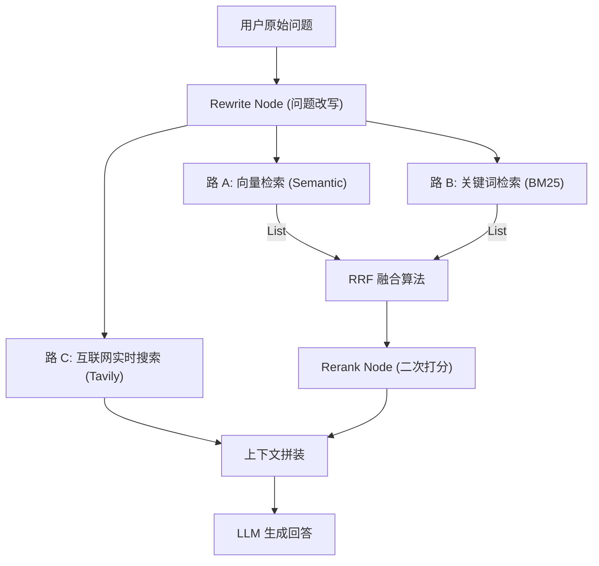

# RAG 核心算法与检索优化（RAG Deep Dive）

RAG（检索增强生成）是投研助手的灵魂。本项目实现了从“初级 RAG”到“多路召回+重排”的进阶。

## 1. 混合检索管道 (Hybrid Retrieval Pipeline)

## 2. 核心数学原理：RRF 融合

为了整合 **Vector（相似度 0~1）** 和 **BM25（相关性得分 0~∞）**，我们不能直接相加。

**Reciprocal Rank Fusion (RRF)** 算法公式：
$$score(d \in D) = \sum_{r \in R} \frac{1}{k + r(d)}$$

- **逻辑**：不看分数高低，只看排名。第 1 名的权重远高于第 10 名。
- **优势**：无需对不同源的数据做归一化，能有效兼顾“意思相近（向量）”和“词汇对齐（关键词）”。

## 3. 向量索引优化：HNSW

在 PostgreSQL 中，我们通过 `pgvector` 插件启用了 **HNSW (Hierarchical Navigable Small Worlds)** 索引。

- **对比 IVF**：IVF 需要聚类（Cluster），数据分布变化后需要重新训练。
- **HNSW 优势**：基于图结构，支持增量添加数据，检索效率呈指数级提升。
- **面试金句**：*“我通过 HNSW 索引将百万级向量的检索耗时控制在了 50ms 以内，由于它是基于图的负采样搜索，完美平衡了召回率与计算开销。”*

## 4. 检索精度提升策略

| 策略 | 实现方式 | 解决问题 |
| :--- | :--- | :--- |
| **Query Rewrite** | LLM 生成多路搜索词 | 解决用户提问模糊、口语化问题 |
| **Hybrid Search** | Vector + BM25 并发 | 解决语义检索对“股票代码/日期”不敏感的问题 |
| **Rerank** | 对 Top 10 进行语义重排 | 解决初始检索召回噪声大的问题 |
