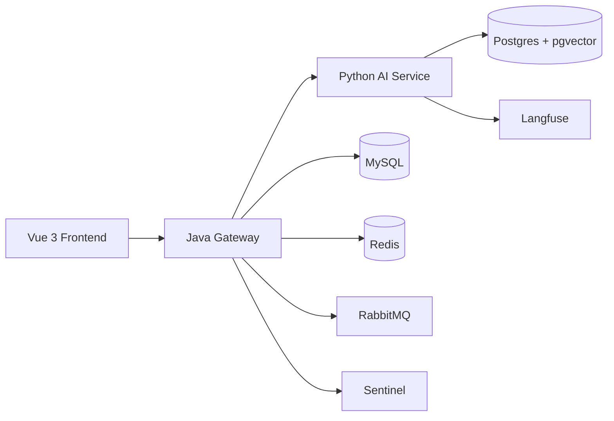
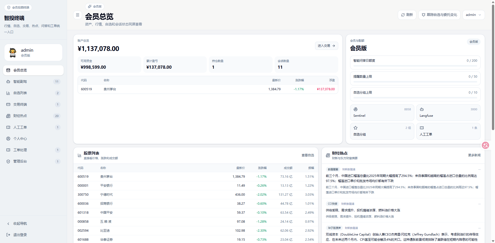

# AI Investor

<p align="center">
  
</p>

<p align="center">
  面向投顾会员场景的 AI 原生投资工作台。<br />
  它不是单点的聊天 Demo，而是一套把 <strong>会员体系、行情查询、自选股、AI 投研副驾、模拟交易、AI 转人工闭环</strong> 串起来的产品骨架。
</p>

<p align="center">
  
  
  
  
  
</p>

## 项目亮点

- 不是“接个大模型 API”的玩具项目，而是有完整业务边界的 AI 产品工作台。
- 采用 `Java + Python` 双后端架构：Java 负责主业务真相与对外 API，Python 负责 Agent、流式问答、RAG 与模型编排。
- 具备从 `AI 问答 -> 风险升级 -> 人工兜底工单 -> 回到原会话` 的完整闭环，适合展示 AI 应用在真实业务中的落地能力。
- 同时覆盖 `身份/会员/配额/行情/自选/模拟交易/Agent/观测`，更像一个可持续迭代的产品底座，而不只是一个功能点。
- 仓库包含可运行的前后端与中间件编排，支持本地一键启动和完整演示。

## 面试官应该看什么

这个项目重点展示的不是“模型会聊天”，而是下面这些工程能力：

- 业务建模能力：把 AI 能力放进会员投顾产品，而不是孤立地做聊天框。
- 架构拆分能力：知道什么放 Java 主业务，什么放 Python AI 侧车。
- AI 应用工程化：SSE 流式输出、RAG、LangGraph、多服务协作、AI 转人工。
- 产品意识：从用户登录、行情查看、自选股、AI 投研到模拟交易，形成完整故事线。
- 可观测与可运维：Langfuse、Sentinel、RabbitMQ、Redis、MySQL、pgvector 都已经纳入系统设计。

## 核心能力

### 1. 会员身份与配额

- 用户资料与身份信息
- 会员权益识别
- 功能配额与调用限制

### 2. 行情与自选股

- 个股行情查询
- 板块信息查询
- 自选分组管理

### 3. AI 投研副驾

- 流式问答
- 标题摘要
- 行情解释
- 后续可扩展 RAG / Agent 工作流

### 4. 模拟交易

- 模拟账户
- 持仓与订单
- 下单与撤单

### 5. AI 转人工闭环

- AI 无法稳定处理时触发升级
- 生成人工工单
- 工单可回到原始会话继续处理

## 系统架构



### 架构分工

- `frontend`：Vue 3 工作台，承接登录、行情、自选、模拟交易、AI 会话与工单面板。
- `java-ai-gateway`：主业务服务，负责身份、会员、行情、自选、模拟交易、AI 会话入口、人工工单等业务真相。
- `aipy2`：Python AI 服务，负责模型调用、SSE 流式输出、标题生成、RAG / LangGraph 扩展。
- `docker-compose.yml`：本地中间件编排，包括 MySQL、Redis、RabbitMQ、Postgres、Langfuse、Sentinel。

## 技术栈

### 后端

- Java 17
- Spring Boot
- MyBatis / MyBatis-Plus
- FastAPI
- LangGraph

### 前端

- Vue 3
- TypeScript

### 基础设施

- MySQL
- Redis
- RabbitMQ
- Postgres + pgvector
- Langfuse
- Sentinel

## 仓库结构

```text
ai-investor/
├─ frontend/              # Vue 3 前端工作台
├─ java-ai-gateway/       # Java 主业务服务
├─ aipy2/                 # Python AI 服务
├─ data/                  # 本地数据与中间件挂载目录
├─ logs/                  # 一键启动后的日志输出
├─ docker-compose.yml     # 中间件编排
├─ start_all.ps1          # Windows 本地一键启动脚本
├─ ARCHITECTURE.md        # 架构深度说明
└─ PROJECT_PLAN.md        # 一期规划说明
```

## 快速启动

推荐在 Windows PowerShell 下直接运行：

```powershell
.\start_all.ps1
```

脚本会自动完成：

- 检查 `docker`、`java`、`node`、`npm`、`mvn`、Python 虚拟环境
- 启动 `docker compose` 中间件
- 启动 Python AI、Java Gateway、Frontend
- 轮询健康检查
- 输出访问地址、演示账号和日志目录

### 启动后可访问地址

- 前端工作台：`http://127.0.0.1:5173`
- Java 网关：`http://127.0.0.1:8080`
- Python AI：`http://127.0.0.1:8000`
- Langfuse：`http://127.0.0.1:3000`
- Sentinel 控制台：`http://127.0.0.1:8858`

### 默认演示账号

- 用户名：`admin`
- 密码：`123456`

## 演示路线

### 路线 1：AI 投研 + 转人工闭环

1. 使用 `admin / 123456` 登录。
2. 在 AI 会话页发起普通投研问题，观察 SSE 流式回答。
3. 再输入“转人工”或触发高风险 / 不稳定场景。
4. 打开人工工单面板，查看兜底工单。
5. 点击工单返回原始会话，演示完整闭环。

### 路线 2：会员终端工作台

1. 登录后查看用户资料与会员信息。
2. 查询个股行情与板块。
3. 创建自选分组并添加股票。
4. 初始化模拟账户并尝试下单。
5. 结合 AI 问答与人工工单，展示完整产品故事线。

## 页面预览

推荐把截图统一放在 `docs/images/` 目录，再在 README 里引用。

### 会员总览工作台

<p align="center">
  
</p>

这张图适合放在 README 里作为第一张产品截图，能直接体现：

- 会员工作台首页
- 行情与自选联动
- 财经热点卡片
- 模拟交易入口
- AI 与人工工单并存的产品形态

### 最简单的 Markdown 写法

```md

```

### 想控制图片宽度时，用 HTML

```html
<p align="center">
  
</p>
```

### 多图并排展示

```html
<p align="center">
  
  
</p>
```

### 使用图片时的注意点

- 路径尽量使用相对路径，比如 `./docs/images/xxx.png`
- GitHub 上路径区分大小写，文件名要和实际一致
- 目录里要真的提交图片文件，否则远程仓库不会显示
- 演示图优先放登录页、AI 会话页、自选股页、模拟交易页、人工工单页

## 核心接口

<details>
<summary>展开查看一期核心接口</summary>

### 身份与会员

- `GET /api/v1/users/me`
- `GET /api/v1/memberships/me`
- `GET /api/v1/quotas/me`

### 行情与自选

- `GET /api/v1/market/quotes?symbols=600519,000001`
- `GET /api/v1/sectors`
- `GET /api/v1/watchlists`
- `POST /api/v1/watchlists`
- `POST /api/v1/watchlists/{id}/items`
- `DELETE /api/v1/watchlists/{id}/items/{itemId}`

### 模拟交易

- `GET /api/v1/paper/accounts/me`
- `GET /api/v1/paper/accounts/{id}/positions`
- `GET /api/v1/paper/accounts/{id}/orders`
- `POST /api/v1/paper/orders`
- `POST /api/v1/paper/orders/{id}/cancel`

### AI 副驾

- `POST /api/v1/ai/chat`
- `POST /api/v1/ai/chat/stream`
- `GET /api/v1/ai/handoff-tickets`

</details>

## 相关文档

- [架构深度说明](./ARCHITECTURE.md)
- [一期计划书](./PROJECT_PLAN.md)

## 当前状态

项目仍在持续迭代中，当前重点是把“AI 投顾会员终端一期”做成一个更完整、可演示、可扩展的工程样板。
