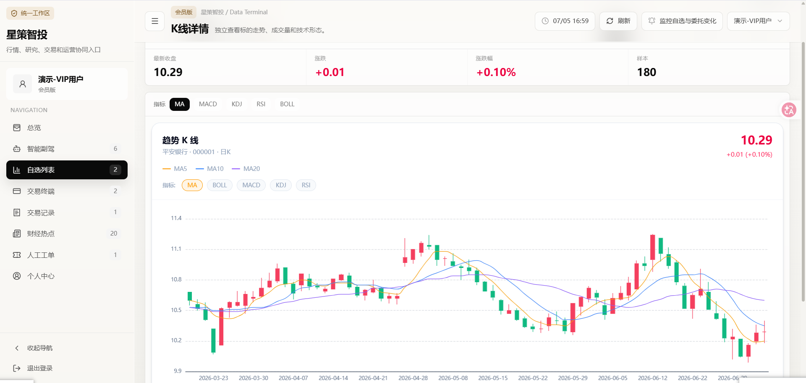
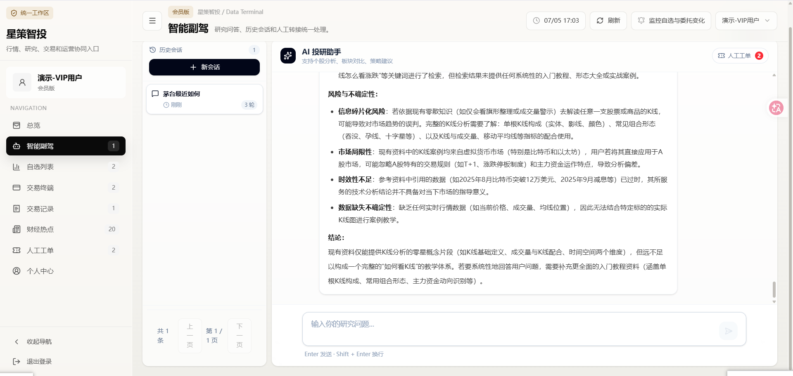
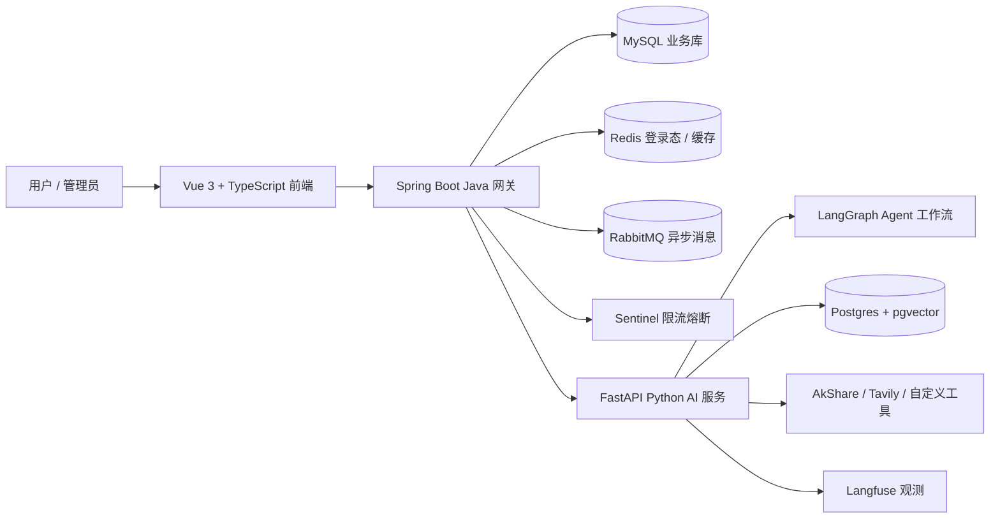

# 星策智投 AI Investor

一个面向投资研究场景的全栈 AI 工作台。项目把行情数据、自选股、K 线图表、模拟交易、AI 投研问答、人工兜底工单和后台管理串成一条完整业务链路，不是单纯的大模型聊天 Demo。


## 项目预览

| K 线详情 | AI 投研助手 |
| --- | --- |
|  |  |

## 为什么值得看

- **不是套壳聊天页**：有用户、会员、行情、自选、模拟交易、AI 会话、人工工单、管理台等完整业务对象。
- **Java + Python 分层清楚**：Java 网关负责稳定业务、鉴权、缓存和审计；Python 服务负责 LangGraph、RAG、工具调用和行情补充。
- **前端有产品形态**：Vue 3 数据终端风格界面，包含高密度工作台、K 线图、AI 会话、后台管理。
- **AI 链路可解释**：支持会话历史、traceId、检索增强、Tavily 联网检索兜底、低置信度人工兜底。
- **工程化不是摆设**：Spring Security、Redis 登录态、Flyway/Alembic 迁移、RabbitMQ、Sentinel、Langfuse、冒烟测试和压测脚本都有对应职责。

## 技术架构



### 分层思路

| 层级 | 职责 |
| --- | --- |
| `frontend/` | 终端式工作台、宣传页、登录页、管理台、图表和 AI 会话展示 |
| `java-ai-gateway/` | 登录鉴权、用户会员、行情缓存、自选股、模拟交易、工单、AI 请求代理 |
| `aipy2/` | LangGraph 工作流、RAG 检索、联网搜索、行情工具、K 线数据、SSE 流式输出 |
| `docker-compose.yml` | MySQL、Redis、RabbitMQ、Postgres/pgvector、Langfuse、Sentinel 本地编排 |

## 核心功能

### 投研工作台

- 行情列表、股票搜索、自选股分组、K 线详情页。
- ECharts K 线图，支持 MA/MACD/KDJ/RSI/BOLL 等技术指标。
- 个股名称、价格、涨跌幅、成交额、更新时间等数据表格化展示。
- 热点资讯、监控提醒、个人中心和会员状态。

### AI 投研助手

- 流式 AI 问答，前端使用 `fetch + ReadableStream` 消费 SSE。
- 会话历史、自动标题、时间记录和多轮上下文。
- RAG 本地检索和 Tavily 联网检索兜底。
- 低置信度或需要人工判断时创建人工工单。
- Java 网关统一处理登录态、用户身份、会员配额和审计字段。

### 模拟交易

- 模拟账户、资金余额、持仓、委托、成交和资金流水。
- 行情数据与交易页面联动，便于演示“看行情 -> 问 AI -> 做模拟决策”的闭环。

### 后台管理

- 用户、会员、AI 会话、人工工单、公告等后台视图。
- 管理员可以处理人工兜底工单，让 AI 系统有运营闭环。

## 关键链路

### 登录鉴权

1. 用户登录 Java 网关。
2. Spring Security 校验账号密码。
3. 网关签发 Bearer Token 并写入 Redis。
4. 后续请求通过过滤器解析 Token，写入用户上下文。
5. 业务接口继续按角色、会员和配额做权限控制。

### AI 流式问答

1. 前端携带 Bearer Token 发起 AI 请求。
2. Java 网关注入 `userId / role / traceId / sessionId`。
3. 网关调用 Python AI 服务的流式接口。
4. Python 通过 LangGraph 执行改写、检索、工具调用、生成和评审。
5. SSE 增量返回给前端，同时保存会话历史和审计信息。
6. 回答质量不足时进入人工工单。

### 行情与 K 线

1. 前端请求 Java 网关行情接口。
2. Java 优先读取 Redis 缓存和 MySQL 快照。
3. 缓存未命中时调用 Python 行情工具。
4. Python 通过 AkShare/外部数据源拉取行情和 K 线。
5. Java 回写缓存，前端展示表格和图表。

## 本地启动

### 环境要求

- JDK 21
- Maven 3.9+
- Node.js 18+
- Python 3.11+
- uv
- Docker Desktop / Docker Engine

### 1. 启动中间件

```powershell
cd ai-investor
docker compose up -d mysql redis rabbitmq postgres langfuse sentinel-dashboard
```

### 2. 初始化 Python AI 服务

```powershell
cd aipy2
copy .env.example .env
uv sync
uv run alembic upgrade head
uv run python main.py
```

`aipy2/.env` 中需要按你的模型供应商补齐 API Key。Tavily、Langfuse 等能力没有配置时，相关链路会降级或不可用。

### 3. 启动 Java 网关

```powershell
cd java-ai-gateway
mvn spring-boot:run
```

默认网关地址：`http://127.0.0.1:8080`

如果端口被占用，可以直接换端口：

```powershell
mvn spring-boot:run "-Dspring-boot.run.arguments=--server.port=18095"
```

### 4. 启动前端

```powershell
cd frontend
npm install
npm run dev -- --host 127.0.0.1 --port 5173
```

如果 Java 网关换了端口：

```powershell
$env:VITE_PROXY_TARGET="http://127.0.0.1:18095"
npm run dev -- --host 127.0.0.1 --port 5173
```

## 常用地址

| 服务 | 地址 |
| --- | --- |
| 前端工作台 | `http://127.0.0.1:5173` |
| Java 网关 | `http://127.0.0.1:8080` |
| Python AI 服务 | `http://127.0.0.1:8000` |
| RabbitMQ 管理台 | `http://127.0.0.1:15672` |
| Langfuse | `http://127.0.0.1:3000` |
| Sentinel Dashboard | `http://127.0.0.1:8858` |

## 演示数据

基础迁移会初始化管理员账号：

```text
admin / 123456
```

初始化演示用户、会员、自选股、持仓、会话和工单：

```powershell
cd aipy2
uv run python -m scripts.seed_demo_data
```

演示脚本会创建以下用户，默认密码均为 `123456`：

```text
investor_zhang
investor_li
investor_wang
investor_chen
investor_sun
```

## 测试与构建

前端构建：

```powershell
cd frontend
npm run build
```

Java 测试：

```powershell
cd java-ai-gateway
mvn test
```

Python 测试：

```powershell
cd aipy2
uv run pytest
```

冒烟检查：

```powershell
cd ai-investor
python .\demo_smoke_test.py
```

压测示例：

```powershell
cd ai-investor
python .\stress_test.py --concurrency 10 --requests 20 --markdown-out docs/PRESSURE_TEST_RESULT.md
```

## 仓库结构

```text
.
├── frontend/                 # Vue 3 前端：宣传页、工作台、管理台
├── java-ai-gateway/          # Spring Boot 网关：业务、鉴权、交易、工单、AI 代理
├── aipy2/                    # FastAPI + LangGraph：AI 工作流、RAG、行情工具
├── docs/                     # 演示说明、工程文档、压测结果和截图
├── docker-compose.yml        # 本地中间件编排
├── demo_smoke_test.py        # 演示环境冒烟脚本
├── stress_test.py            # 简单并发压测脚本
└── README.md
```

## 面试讲解建议

可以按这个顺序讲：

1. 先讲业务闭环：行情、自选、K 线、AI 投研、模拟交易、人工兜底、管理台。
2. 再讲架构拆分：Java 做稳定业务网关，Python 做 AI 编排和工具调用。
3. 重点解释为什么前端不直连大模型：鉴权、会员、限流、审计、人工兜底都需要统一入口。
4. 展开 AI 链路：SSE 流式输出、LangGraph、RAG、联网检索、traceId 和 Langfuse 观测。
5. 最后讲工程化：Redis 缓存、RabbitMQ 异步化、Flyway/Alembic 迁移、Sentinel 限流、冒烟和压测。

适合重点展开的技术问题：

- 为什么 `EventSource` 不适合需要认证 Header 的场景，所以使用 `fetch + ReadableStream`。
- 为什么行情需要 Redis 短 TTL 缓存和 MySQL 快照兜底。
- 为什么业务数据放 MySQL，而向量检索和 LangGraph checkpoint 放 Postgres/pgvector。
- 为什么 AI 系统需要人工兜底，而不是让模型在低置信度时硬答。
- Spring Security 改造后，如何保持 Controller 层的业务权限语义清晰。

## 参考文档

- [架构说明](ARCHITECTURE.md)
- [演示手册](docs/DEMO_RUNBOOK.md)
- [功能清单](docs/FEATURES.md)
- [工程化说明](docs/ENGINEERING.md)
- [压测说明](docs/PRESSURE_TEST.md)
- [压测结果](docs/PRESSURE_TEST_RESULT.md)

## 说明

本项目用于学习、作品集和面试展示。行情、AI 分析和模拟交易结果仅用于技术演示，不构成任何投资建议。
