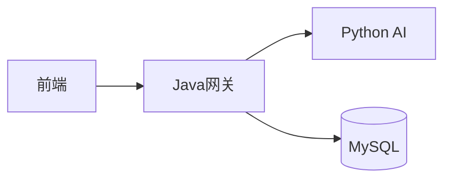

# Markdown 完整学习指南

## 为什么用 Markdown

你可能用过 Word、Google Docs 这些富文本编辑器，它们靠鼠标点击来设置格式。Markdown 的思路完全不同——**用纯文本符号来标记格式**。

这带来三个核心好处：

1. **Git 友好**：纯文本文件，每次修改都能看到具体改了什么（diff 清晰）。Word 的 `.docx` 是二进制格式，git 完全看不出改了哪里。
2. **全平台通用**：GitHub、GitLab、VS Code、Notion、Jupyter Notebook、微信公众号（部分）、知乎、掘金……几乎所有技术平台都原生支持 Markdown。
3. **写起来快**：不用离开键盘，所有格式用符号就能完成。

简单说：**Markdown 是程序员的"通用纸笔"。**

---

## 一、标题

用 `#` 号表示标题，几个 `#` 就是几级：

```markdown
# 一级标题
## 二级标题
### 三级标题
#### 四级标题
##### 五级标题
###### 六级标题
```

实际效果：

# 一级标题
## 二级标题
### 三级标题

**规则：**
- `#` 后面要加一个空格
- 一个文件通常只有一个 `#`（一级标题）
- GitHub 会根据标题自动生成目录锚点（点击标题旁的链接图标可以复制链接）

**实践：** 你的 `README.md` 第一行 `# AI Investor` 就是一级标题。

---

## 二、文本格式

### 加粗

用两对星号包裹：

```markdown
**这是加粗文字**
```

效果：**这是加粗文字**

### 斜体

用一对星号包裹：

```markdown
*这是斜体文字*
```

效果：*这是斜体文字*

### 加粗 + 斜体

用三对星号：

```markdown
***加粗且斜体***
```

效果：***加粗且斜体***

### 删除线

用两对波浪号：

```markdown
~~这是删除线~~
```

效果：~~这是删除线~~

### 行内代码

用反引号（键盘左上角那个键 `~`）：

```markdown
`print("hello")`
```

效果：`print("hello")`

这个在技术文档里非常常用，用来标记函数名、变量名、命令等。

---

## 三、列表

### 无序列表

用 `-`、`*` 或 `+` 开头（推荐用 `-`）：

```markdown
- 第一项
- 第二项
  - 嵌套子项（前面加两个空格）
  - 另一个子项
- 第三项
```

效果：
- 第一项
- 第二项
  - 嵌套子项
  - 另一个子项
- 第三项

### 有序列表

用数字开头：

```markdown
1. 第一步
2. 第二步
3. 第三步
```

效果：
1. 第一步
2. 第二步
3. 第三步

注意：数字写错也没关系，Markdown 会自动修正顺序。但建议写对，方便阅读源码。

### 任务列表（GitHub 特有）

```markdown
- [x] 已完成的任务
- [ ] 未完成的任务
- [ ] 另一个待办
```

效果（GitHub 上会显示为可勾选的复选框）：
- [x] 已完成的任务
- [ ] 未完成的任务
- [ ] 另一个待办

---

## 四、链接和图片

### 链接

```markdown
[显示文字](URL)
```

示例：

```markdown
[GitHub](https://github.com)
[项目架构文档](./ARCHITECTURE.md)    # 相对路径，链接到本地文件
```

效果：
- [GitHub](https://github.com)
- [项目架构文档](./ARCHITECTURE.md)

**相对路径 vs 绝对路径：**
- `./ARCHITECTURE.md` — 相对路径，从当前文件所在目录找
- `/docs/learning/01-markdown.md` — 从仓库根目录找
- `https://github.com/xxx` — 绝对路径，直接访问外部链接

### 图片

和链接类似，只是前面多了个 `!`：

```markdown

```

示例：

```markdown

```

**控制图片大小：** Markdown 本身不能控制图片大小，需要嵌入 HTML：

```html
<p align="center">
  
</p>
```

**实践：** 你的 README 里就用了这种方式来居中显示图片和控制宽度。

---

## 五、代码块

### 行内代码

```markdown
使用 `pip install` 安装依赖
```

效果：使用 `pip install` 安装依赖

### 多行代码块

用三个反引号包裹，可以指定语言来获得语法高亮：

````markdown
```python
def hello(name):
    print(f"Hello, {name}")
```
````

效果：

```python
def hello(name):
    print(f"Hello, {name}")
```

### 常用语言标记

| 标记 | 语言 |
|------|------|
| `python` | Python |
| `java` | Java |
| `javascript` / `js` | JavaScript |
| `typescript` / `ts` | TypeScript |
| `html` | HTML |
| `css` | CSS |
| `sql` | SQL |
| `bash` / `shell` | Shell 命令 |
| `powershell` | PowerShell |
| `yaml` / `yml` | YAML |
| `json` | JSON |
| `text` / `plaintext` | 纯文本（不高亮） |
| `mermaid` | 流程图/图表 |

### 用缩进写代码块（不推荐）

四个空格或一个 tab 也能产生代码块，但不推荐，因为：
- 不支持语法高亮
- 容易和列表缩进混淆

---

## 六、引用

用 `>` 开头：

```markdown
> 这是一段引用。
> 可以多行写。
>
> 还可以空一行再继续。
```

效果：

> 这是一段引用。
> 可以多行写。
>
> 还可以空一行再继续。

**嵌套引用：**

```markdown
> 第一层引用
>> 第二层嵌套
>>> 第三层嵌套
```

效果：

> 第一层引用
>> 第二层嵌套
>>> 第三层嵌套

**实用场景：** 引用常用来写注意事项、提示、引用他人的话等。

---

## 七、表格

```markdown
| 列1 | 列2 | 列3 |
|:----|:---:|----:|
| 左对齐 | 居中 | 右对齐 |
| 数据1 | 数据2 | 数据3 |
```

效果：

| 列1 | 列2 | 列3 |
|:----|:---:|----:|
| 左对齐 | 居中 | 右对齐 |
| 数据1 | 数据2 | 数据3 |

**对齐语法：**
- `:---` 左对齐（默认）
- `:---:` 居中对齐
- `---:` 右对齐

**实践：** 表格在写 API 文档、技术选型对比、功能清单时非常好用。

---

## 八、分割线

用三个以上的 `-`、`*` 或 `_`：

```markdown
---
***
___
```

效果（都是同一条分割线）：

---

## 九、特殊语法

### 脚注（部分平台支持）

```markdown
这是一段文字[^1]。

[^1]: 这是脚注内容。
```

### 数学公式（GitHub 支持）

```markdown
行内公式：$E = mc^2$

块级公式：
$$
\sum_{i=1}^{n} x_i
$$
```

### Emoji

```markdown
:smile:  :rocket:  :thumbsup:
```

GitHub 会自动渲染成 😄 🚀 👍

---

## 十、GitHub Flavored Markdown（GFM）

GitHub 在标准 Markdown 基础上扩展了一些语法：

### 1. 任务列表（前面已提到）

### 2. 表格（前面已提到）

### 3. 折叠块

```html
<details>
<summary>点击展开详细内容</summary>

这里写折叠的内容，支持所有 Markdown 语法。

甚至可以放代码块：

```python
print("折叠里的代码")
```

</details>
```

效果：

<details>
<summary>点击展开详细内容</summary>

这里写折叠的内容，支持所有 Markdown 语法。

</details>

**实践：** 你的 README 里用这个折叠了 API 接口列表，避免页面太长。

### 4. Mermaid 图表

````markdown

````

效果（GitHub 会渲染成流程图）：


常用的 Mermaid 图表类型：

```mermaid
# 流程图
graph TD
    A[开始] --> B{判断}
    B -->|是| C[执行]
    B -->|否| D[结束]

# 时序图
sequenceDiagram
    participant U as 用户
    participant S as 服务器
    U->>S: 发请求
    S-->>U: 返回数据

# 甘特图
gantt
    title 项目计划
    section 阶段1
    任务1: 2024-01-01, 30d
    section 阶段2
    任务2: 2024-02-01, 20d
```

---

## 十一、HTML 混写

Markdown 文件里可以直接写 HTML，这在需要 Markdown 做不到的格式时很有用：

### 居中对齐

```html
<p align="center">居中的文字</p>
```

### 控制图片大小

```html

```

### 多图并排

```html
<p align="center">
  
  
</p>
```

### 颜色文字（仅部分平台支持）

```html
<font color="red">红色文字</font>
```

**注意：** 不是所有 Markdown 渲染器都支持 HTML。GitHub 支持，但微信公众号不支持。能用纯 Markdown 解决的就不要用 HTML。

---

## 十二、实际应用：README 模板

一个标准项目的 README 通常包含这些部分：

```markdown
# 项目名称

一句话描述项目是做什么的。

## 功能特性

- 特性1
- 特性2
- 特性3

## 快速开始

### 环境要求

- Python 3.11+
- Node.js 20+

### 安装

​```bash
git clone https://github.com/xxx/xxx.git
cd xxx
pip install -r requirements.txt
​```

### 启动

​```bash
python main.py
​```

## 项目结构

​```text
project/
├── src/
├── tests/
├── docs/
└── README.md
​```

## API 文档

<details>
<summary>展开查看接口列表</summary>

- `GET /api/xxx`
- `POST /api/xxx`

</details>

## License

MIT
```

---

## 十三、常见错误

### 1. 标题后没加空格

```markdown
#错误写法（不会渲染成标题）
# 正确写法
```

### 2. 列表前没空行

```markdown
文字紧挨着列表（可能不会渲染）
- 列表项1

文字空一行再写列表（正确）
- 列表项1
```

### 3. 代码块没指定语言

```markdown
​```
# 不指定语言 = 没有语法高亮
​```

​```python
# 指定语言 = 有语法高亮
​```
```

### 4. 中英文之间没空格

这是排版习惯，不是语法错误，但加上空格更美观：

```markdown
# 不推荐
使用Python开发

# 推荐
使用 Python 开发
```

---

## 十四、学习资源

- [GitHub Markdown 官方文档](https://docs.github.com/en/get-started/writing-on-github)
- [Markdown 语法大全（中文）](https://www.markdown.xyz/)
- [Mermaid 在线编辑器](https://mermaid.live/)

---

## 练习建议

1. **改你的 README** — 最好的练习就是动手改项目的 README
2. **写学习笔记** — 用 Markdown 记录每天的学习内容
3. **GitHub 写 Issue** — 提 issue 时用 Markdown 描述 bug，练习格式
4. **做这个目录** — 接下来我们会在 `docs/learning/` 里继续写其他技术的学习笔记

---

> 下一篇：[02 - Git 基础](./02-git-basics.md)（待写）
