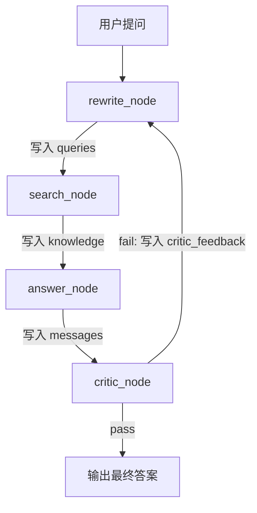

# 教程 01：AgentState —— LangGraph 的灵魂

## 一句话概念
AgentState 就是 **AI 的"工作台"**。它记录了 AI 当前在想什么、找到了什么资料、已经重试了几次。每个节点（Node）从工作台上**拿东西**、**放东西**，最终形成一个完整的答案。

---

## 1. 什么是 State（状态）？

想象你在写一份研究报告：
- 📝 你的**笔记本**上记着：要搜的关键词、找到的资料、写好的草稿、导师的批注……
- 每写一步，你都在笔记本上更新进度。

在 LangGraph 里，这个"笔记本"就是 **AgentState**。

---

## 2. 逐字段拆解

打开 [investor_graph.py](file:///d:/ai-investor/aipy2/app/graph/investor_graph.py#L17-L29)，你会看到：

```python
class AgentState(TypedDict):
    messages: Annotated[list, add_messages]  # 对话历史
    queries: list[str]                        # 搜索关键词列表
    knowledge: str                            # 检索到的参考资料
    step: str                                 # 当前步骤描述（给前端看的）
    retry_count: int                          # 重试次数
    review_status: str                        # 评审结论：pass / fail
    critic_feedback: str                      # 评审意见
    total_tokens: int                         # Token 消耗量
```

### 每个字段的作用

| 字段 | 类比 | 谁在写 | 谁在读 |
|------|------|--------|--------|
| [messages](file:///d:/ai-investor/aipy2/app/core/llm.py#86-105) | 聊天记录 | [answer_node](file:///d:/ai-investor/aipy2/app/graph/investor_graph.py#73-93) 写入AI回答 | [rewrite_node](file:///d:/ai-investor/aipy2/app/graph/investor_graph.py#33-62) 读取用户原始问题 |
| `queries` | 搜索关键词清单 | [rewrite_node](file:///d:/ai-investor/aipy2/app/graph/investor_graph.py#33-62) 生成 | [search_node](file:///d:/ai-investor/aipy2/app/graph/investor_graph.py#63-72) 拿去搜索 |
| `knowledge` | 搜到的参考资料 | [search_node](file:///d:/ai-investor/aipy2/app/graph/investor_graph.py#63-72) 填充 | [answer_node](file:///d:/ai-investor/aipy2/app/graph/investor_graph.py#73-93) 和 [critic_node](file:///d:/ai-investor/aipy2/app/graph/investor_graph.py#94-138) 读取 |
| `step` | 进度播报 | 每个节点都写 | 前端实时展示 |
| `retry_count` | 重试计数器 | [critic_node](file:///d:/ai-investor/aipy2/app/graph/investor_graph.py#94-138) 累加 | [critic_node](file:///d:/ai-investor/aipy2/app/graph/investor_graph.py#94-138) 判断是否兜底 |
| `review_status` | 评审结论 | [critic_node](file:///d:/ai-investor/aipy2/app/graph/investor_graph.py#94-138) 写入 | [route_judge](file:///d:/ai-investor/aipy2/app/graph/investor_graph.py#141-146) 决定走"重试"还是"结束" |
| `critic_feedback` | 导师批注 | [critic_node](file:///d:/ai-investor/aipy2/app/graph/investor_graph.py#94-138) 写入 | [rewrite_node](file:///d:/ai-investor/aipy2/app/graph/investor_graph.py#33-62) 读取并改进搜索词 |
| `total_tokens` | 费用计数器 | 每个调LLM的节点累加 | `final_answer` 透传给前端 |

---

## 3. 为什么用 `TypedDict` 而不是普通 `dict`？

```python
# ❌ 普通 dict：没有类型提示，IDE 不能补全，运行时才会报错
state = {"mesages": [...]}  # 拼错了 messages，不会有任何提示

# ✅ TypedDict：有严格的类型定义
class AgentState(TypedDict):
    messages: list  # IDE 会自动补全，拼错立刻报红
```

> **面试点**：TypedDict 是 Python 的"结构化类型"，它让字典拥有了类/接口的约束能力，同时保留了字典的灵活性。

---

## 4. `Annotated[list, add_messages]` 是什么？

这是 LangGraph 最精妙的设计之一：

```python
messages: Annotated[list, add_messages]
```

- `Annotated` 是 Python 的类型注解增强。
- `add_messages` 是 LangGraph 提供的**归约器 (Reducer)**。
- 作用：当一个节点返回 `{"messages": [new_msg]}` 时，不是**替换**原有消息列表，而是**追加**到末尾。

```python
# 没有 add_messages 的行为：
state["messages"] = [new_msg]  # 原来的消息全丢了！

# 有 add_messages 的行为：
state["messages"].append(new_msg)  # 旧消息保留，新消息追加
```

> **面试点**：Reducer 模式来自 Redux 思想。LangGraph 用它来解决"多个节点同时更新同一个字段时如何合并"的问题。

---

## 5. 数据流图示



每条箭头代表的就是一次 **State 的更新**。数据在节点之间通过 State 流转，这就是 LangGraph 的核心设计。

---

## 6. 动手练习

试着在 [AgentState](file:///d:/ai-investor/aipy2/app/graph/investor_graph.py#17-30) 里新增一个字段 `confidence: float`，用来记录 AI 对自己答案的置信度（0.0 ~ 1.0）。然后在 [critic_node](file:///d:/ai-investor/aipy2/app/graph/investor_graph.py#94-138) 中，根据评审结果设置这个值。

